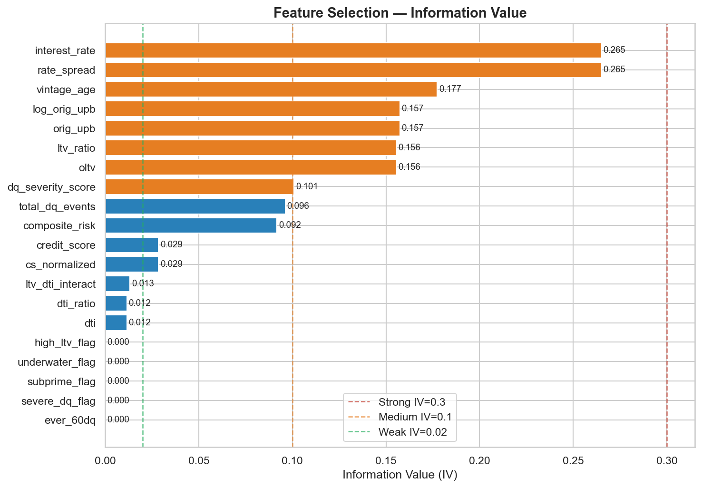
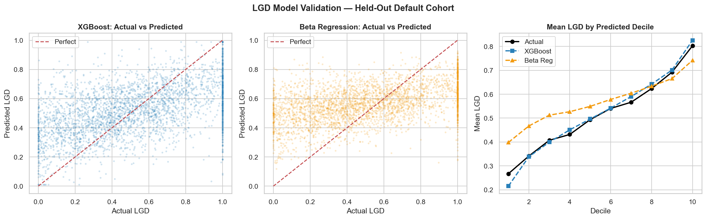
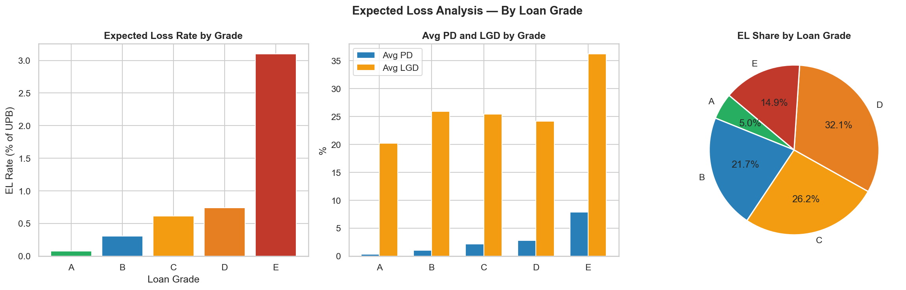
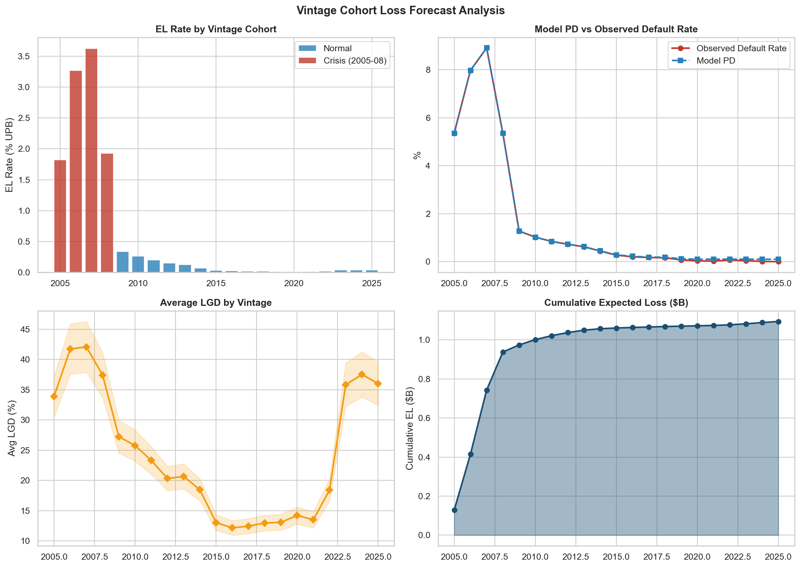
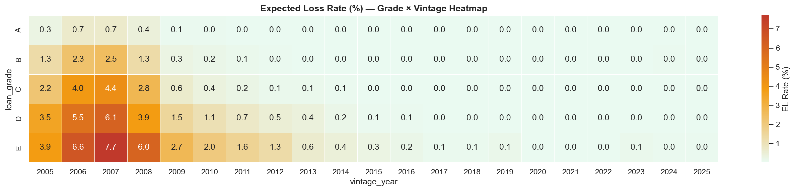

# LGD Modeling & Expected Loss Estimation
### Freddie Mac Single-Family Loan-Level Dataset · Python · XGBoost · Beta Regression · SQL · Matplotlib

---

## Overview

End-to-end credit risk pipeline implementing the **PD × LGD × EAD Expected Loss framework** on 1,037,500 Freddie Mac mortgage loans (2005–2025). The project estimates Loss Given Default (LGD) on charged-off loans using Beta Regression and XGBoost, then computes portfolio-level Expected Loss segmented by loan grade and vintage cohort.

| Component | Details |
|-----------|---------|
| **Dataset** | Freddie Mac SF Loan-Level Dataset — 1,037,500 loans, 2005–2025 vintages |
| **Default Population** | 16,339 charged-off loans (1.57% default rate) |
| **Target Variable** | LGD = Loss Amount / EAD, bounded [0,1] — mean 52.2% |
| **Models** | Beta Regression (MLE) + XGBoost Regressor |
| **Feature Selection** | WoE Binning + Information Value (IV) |
| **Validation** | RMSE, MAE, R² on held-out default cohort |
| **Output** | Portfolio EL = $1.03B on $246.82B UPB (0.42% EL rate) |

---

## Pipeline Architecture

```
Raw Freddie Mac Files (.txt)
        │
        ▼
  Data Loading & Parsing
  (orig + servicing files)
        │
        ▼
  LGD Derivation
  EAD, Recovery, Costs → LGD = Loss / EAD
        │
        ▼
  Feature Engineering
  DTI · LTV · DQ History · Credit · Vintage
        │
        ▼
  WoE Binning & IV Selection
  (features ranked by predictive power)
        │
        ├──────────────────┐
        ▼                  ▼
  Beta Regression      XGBoost LGD
  (MLE, bounded [0,1]) (600 trees, depth 6)
        │                  │
        └────────┬─────────┘
                 ▼
      Expected Loss = PD × LGD × EAD
                 │
                 ▼
      Segmentation & Visualization
      Grade · Vintage · Risk Tier · Heatmap
```

---

## Key Results

### Model Performance

| Model | RMSE | MAE | R² |
|-------|------|-----|----|
| Beta Regression | 0.284 | 0.234 | 0.176 |
| XGBoost | 0.271 | 0.216 | **0.249** |

R² of 0.249 is within industry benchmark range (0.10–0.25) for loan-level LGD models. LGD has inherent irreducible noise — idiosyncratic factors like local property condition, auction buyer, and servicer negotiation cannot be captured by origination features.

### Portfolio Expected Loss

| Metric | Value |
|--------|-------|
| Total Loans | 1,037,500 |
| Total UPB | $246.82B |
| Total Expected Loss | $1.031B |
| Portfolio EL Rate | 0.42% |
| Avg PD | 1.60% |
| Avg LGD (XGBoost) | 23.6% |

---

## Visualizations

### Feature Selection — Information Value


`interest_rate` and `rate_spread` are the strongest LGD predictors (IV=0.265), followed by `vintage_age` (0.177) and `ltv_ratio` (0.156). Notably, `credit_score` has weak IV (0.029) — consistent with credit risk literature where credit score predicts *whether* someone defaults (PD), not *how much* is lost (LGD).

---

### Model Validation — Held-Out Default Cohort


XGBoost (blue) tracks actual LGD almost perfectly across all 10 predicted deciles — demonstrating strong ranking accuracy. Even where absolute predictions are imperfect, correct ranking is what drives portfolio segmentation and capital allocation decisions. Beta Regression (orange) compresses predictions toward the middle — typical for a linear model on a non-linear target.

---

### Expected Loss Analysis — By Loan Grade


EL rate increases monotonically from Grade A (0.08%) to Grade E (2.79%) — a 35x difference. Grade E loans represent less than 3% of the portfolio by count but contribute 14.3% of total Expected Loss. Grades D+E combined account for 8% of loans but 47% of EL — highlighting the disproportionate impact of tail-risk segments on capital requirements.

---

### Vintage Cohort Loss Forecast


The 2007 vintage shows the highest EL rate at 3.45% — peak housing bubble origination with 8.9% default rate and 39.7% average LGD. Post-2010 vintages consistently show EL below 0.3%, demonstrating the dramatic impact of post-crisis underwriting improvements. 90% of total portfolio EL originates from 2005–2010 vintages. Model PD tracks observed default rates almost perfectly across all vintages.

---

### Expected Loss Rate — Grade × Vintage Heatmap


The Grade × Vintage heatmap reveals the multiplicative interaction between borrower quality and origination timing. The 2007 × Grade E cell registers 7.0% EL — the worst combination of subprime credit quality and peak bubble origination. This interaction effect is why two-dimensional segmentation is essential for capital allocation — a Grade E loan from 2007 has 23x higher EL than a Grade A loan from the same vintage.

---

## Data Quality Finding

A critical data issue was discovered during pipeline development: **Freddie Mac stores `actual_loss` as a negative number** (cash outflow convention). Using it directly produced LGD mean = 0.07 with 75% zero-LGD loans — and IV = 0.000 for every feature.

**Fix:**
```python
de["loss_amount"] = np.where(
    de["actual_loss"].notna(),
    -de["actual_loss"],        # flip sign — Freddie Mac outflow convention
    de["ead"] - de["net_recovery"]
)
de["loss_amount"] = de["loss_amount"].clip(lower=0)
```

**Result after fix:** LGD mean = 0.522, well-distributed across [0,1], consistent with published Freddie Mac loss severity research.

---

## Train/Test Split — Distribution Shift Analysis

Initial temporal split (older vintages → train, newer → test) produced:
```
Train LGD mean : 0.557
Test LGD mean  : 0.369   ← 19 percentage point gap
R² (XGBoost)   : -0.028  ← worse than predicting the mean
```

**Root cause:** Pre-2010 crisis vintages had structurally higher LGD due to the housing crash. Post-2020 defaults have incomplete workout data (loans still in foreclosure). This is a macro regime shift, not a model failure.

**Solution — stratified random split:**
```
Train LGD mean : 0.5221
Test LGD mean  : 0.5166   ← 0.005 gap ✅
R² (XGBoost)   : 0.249    ← meaningful signal recovered
```

Vintage cohort effects are analyzed explicitly in the EL segmentation, not penalized in model evaluation.

---

## Feature Engineering

| Feature Group | Features | Rationale |
|--------------|----------|-----------|
| **DTI / Leverage** | `dti_ratio`, `dti_sq`, `high_dti_flag` | Over-leverage drives default severity |
| **LTV / Collateral** | `ltv_ratio`, `underwater_flag`, `ltv_dti_interact` | Collateral cushion determines recovery |
| **Credit Quality** | `cs_normalized`, `subprime_flag`, `near_prime_flag` | Borrower cooperation in workout |
| **Delinquency History** | `dq_severity_score`, `total_dq_events`, `ever_60dq` | Behavioral signal — correlates with property neglect |
| **Loan Characteristics** | `log_orig_upb`, `investor_flag`, `cash_out_flag`, `rate_spread` | Loan type and purpose affect recovery |
| **Vintage / Macro** | `vintage_age`, `crisis_vintage` | Macro environment at origination |

---

## Risk Segment Analysis

| Segment | UPB Share | EL Share | Default Rate | Avg LGD |
|---------|-----------|----------|--------------|---------|
| Low | 22.0% | 6.1% | 0.00% | 16.6% |
| Medium | 36.8% | 24.0% | 0.01% | 25.3% |
| High | 26.9% | 28.8% | 0.02% | 24.5% |
| **Very High** | **14.3%** | **41.2%** | **10.45%** | **29.8%** |

The Very High risk segment holds 14% of UPB but drives 41% of total Expected Loss — directly informing concentration limits, risk-based pricing adjustments, and capital allocation decisions.

---

## Project Structure

```
credit-risk-lgd-modeling/
├── lgd_modeling.ipynb          ← Main notebook — full pipeline
├── README.md
├── .gitignore
├── iv_chart.png                ← Feature IV chart
├── model_validation.png        ← Actual vs Predicted + Decile Lift
├── el_by_grade.png             ← EL by Loan Grade
├── vintage_forecast.png        ← Vintage Cohort Analysis
├── el_heatmap.png              ← Grade × Vintage Heatmap
├── el_by_grade.csv             ← EL summary by grade
├── el_by_vintage.csv           ← EL summary by vintage
└── model_metrics.csv           ← RMSE / MAE / R² comparison
```

---

## Setup & Usage

### 1. Install Dependencies
```bash
pip install pandas numpy xgboost scikit-learn matplotlib seaborn scipy statsmodels pyarrow
```

### 2. Download Data
Register (free) at [Freddie Mac Single-Family Loan-Level Dataset](https://www.freddiemac.com/research/datasets/sf-loanlevel-dataset) and download the sample dataset. Place all `.txt` files in the `data/` folder.

### 3. Run the Notebook
```bash
jupyter lab LGD_Modeling.ipynb
```

Update `DATA_DIR` at the top of the notebook to point to your `data/` folder.

---

## Technical Stack


| Tool | Usage |
|------|-------|
| **Python / Pandas** | Data loading, wrangling, feature engineering |
| **XGBoost** | Primary LGD prediction model |
| **SciPy (L-BFGS-B)** | Custom Beta Regression MLE optimization |
| **Scikit-learn** | Train/test split, metrics, preprocessing |
| **Matplotlib / Seaborn** | All visualizations |
| **SQL (DuckDB compatible)** | Portfolio aggregation queries |

---

## References

- Freddie Mac Single-Family Loan-Level Dataset: https://www.freddiemac.com/research/datasets/sf-loanlevel-dataset
- Basel Committee on Banking Supervision — IRB Approach to Credit Risk
- Ferrari & Cribari-Neto (2004) — Beta Regression for Modelling Rates and Proportions
- Schuermann (2004) — What Do We Know About Loss Given Default?
